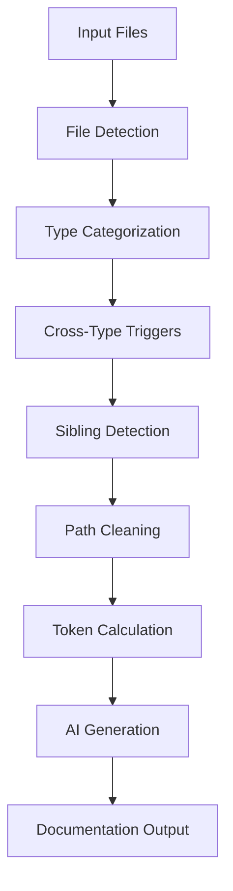

# 📚 Doc-UI - AI Documentation Generator

**Intelligent documentation generation for React, Sass, and Storybook files using AI.**

## 🔭 Overview

Doc-UI is an advanced AI-powered documentation generator that automatically creates comprehensive documentation for your components and styles. It intelligently detects file types, analyzes relationships between files, and generates contextual documentation using Claude AI models.

### ✨ Key Features

- **🤖 Intelligent File Detection**: Automatically categorizes React, Sass, and Storybook files
- **🔄 Cross-Type Triggers**: Smart logic that generates related documentation (e.g., React + Storybook)
- **📍 Path-Based Processing**: Target specific directories or files for documentation
- **🧠 Sibling Detection**: Automatically finds related files (.tsx, .config.ts, .stories.tsx)
- **📝 Smart Naming**: Context-aware file naming (README.md vs COMPONENT.md)
- **⚡ Incremental Updates**: Includes existing documentation for context-aware updates
- **📊 Token Management**: Precise token calculation with safety margins
- **🎯 Mode Detection**: Auto-detects local changes vs pipeline mode

## 🚀 Quick Start

```bash
# Auto-detect and generate all documentation types
codex-ai doc-ui

# Process specific path
codex-ai doc-ui --path react/src/components/Button

# Generate only React documentation
codex-ai doc-ui --doc react

# Preview without costs
codex-ai doc-ui --dry-run --verbose
```

## 📋 Command Reference

### Basic Syntax
```bash
codex-ai doc-ui [OPTIONS]
```

### Options

| Flag | Type | Default | Description |
|------|------|---------|-------------|
| `--mode` | `local`\|`pipeline` | auto-detect | File detection mode |
| `--path` | string | - | Process specific directory/file path |
| `--doc` | `react`\|`sass`\|`storybook`\|`all` | `all` | Documentation type filter |
| `--since` | string | - | For pipeline: files changed since commit/tag |
| `--model` | string | claude-4-sonnet | AI model to use |
| `--output-dir` | string | `docs` | Output directory |
| `--verbose` | flag | false | Enable detailed logging |
| `--dry-run` | flag | false | Preview mode (no AI costs) |

## 🔍 File Detection Logic

### Auto-Detection Modes

#### Local Mode
- **Triggers**: When staged or modified files exist
- **Processes**: `git status` files (staged + modified)
- **Use Case**: Development workflow, local changes

#### Pipeline Mode  
- **Triggers**: When no local changes detected
- **Processes**: Files changed since `origin/main` or `origin/master`
- **Use Case**: CI/CD pipelines, release documentation

#### Path Mode
- **Triggers**: When `--path` flag is used
- **Processes**: ALL relevant files in specified path (bypasses auto-detect)
- **Behavior**: Ignores Git status - processes every matching file found
- **Use Case**: Targeted documentation generation, independent of Git changes

### File Type Patterns

#### React Files
```python
"react": {
    "extensions": [".tsx", ".jsx", ".ts", ".js"],
    "required_patterns": ["component", "src/", ".config.ts"],
    "exclude_patterns": [".test.", ".spec.", ".stories.", ".d.ts", "index."],
    "description": "React components and utilities"
}
```

#### Sass Files
```python
"sass": {
    "extensions": [".scss", ".sass", ".css"],
    "required_patterns": [],
    "exclude_patterns": [".min.", ".map"],
    "description": "Sass/SCSS stylesheets"
}
```

#### Storybook Files
```python
"storybook": {
    "extensions": [".stories.tsx", ".stories.jsx", ".stories.ts", ".stories.js"],
    "required_patterns": [],
    "exclude_patterns": [],
    "description": "Storybook stories"
}
```

## 🔄 Cross-Type Triggers

### Smart Documentation Logic

Doc-UI implements intelligent cross-type triggers to ensure comprehensive documentation:

#### React Component Modified
```
Component.tsx modified → React docs + Storybook docs (if stories exist)
```
- **Triggers**: React documentation generation
- **Cross-Trigger**: Storybook documentation (if `.stories.tsx` exists)
- **Context**: Reads `.tsx`, `.config.ts`, and existing docs

#### Storybook Story Modified
```
Component.stories.tsx modified → Storybook docs only
```
- **Triggers**: Storybook documentation generation
- **Context**: Reads `.tsx`, `.config.ts`, `.stories.tsx`

#### Sass File Modified
```
Component.scss modified → Sass docs only
```
- **Triggers**: Sass documentation generation
- **Context**: Reads `.scss` file only

### Sibling Detection

Doc-UI automatically discovers related files:

```
Button/
├── Button.tsx          # Main component (triggers React + Storybook)
├── Button.config.ts    # Configuration (included in context)
├── Button.stories.tsx  # Stories (triggers cross-type)
└── Button.test.tsx     # Test (excluded)
```

## 📍 Path-Based Processing

### Directory Processing
```bash
# Process entire component directory
codex-ai doc-ui --path react/src/components/atoms/Button

# Process multiple components
codex-ai doc-ui --path react/src/components/atoms/

# Process with type filter
codex-ai doc-ui --path react/src/components/ --doc react
```

### File Processing
```bash
# Process specific file
codex-ai doc-ui --path react/src/components/Button/Button.tsx

# Process specific sass file
codex-ai doc-ui --path sass/src/components/button.scss
```

### Path Cleaning Logic

Doc-UI intelligently cleans paths for consistent output structure:

#### React Files
```
Input:  react/src/components/atoms/Button/Button.tsx
Clean:  components/atoms/Button/Button.tsx
Output: docs/react/components/atoms/Button/README.md
```

#### Sass Files
```
Input:  sass/src/default/components/button.scss
Clean:  default/components/button.scss  
Output: docs/sass/default/components/button.md
```

## 📝 Smart File Naming

### Component-Folder Matching
```bash
# When component name matches folder name
components/Button/Button.tsx → docs/react/components/Button/README.md

# When component name differs from folder
components/forms/LoginForm.tsx → docs/react/components/forms/LOGINFORM.md
```

### Naming Rules
- **README.md**: When component name matches parent folder
- **COMPONENT.md**: When component name differs (uppercase)
- **Sass files**: Always use original filename with `.md` extension

## 📊 Token Management

### Token Calculation
```
Total Input Tokens = Prompt Tokens + Context Files Tokens
```

### Context Files Include
- **React**: `.tsx`, `.config.ts`, existing docs
- **Sass**: `.scss` files only
- **Storybook**: `.tsx`, `.config.ts`, `.stories.tsx`

### Safety Limits
- **Token Limit**: 124,450 (with safety margin)
- **Efficiency Warning**: Shows percentage of limit used
- **Overflow Protection**: Skips processing if exceeds limit

## 🎯 Examples

### Basic Usage

#### Auto-Detection
```bash
# Generates docs for all detected file types
codex-ai doc-ui
```

#### Type-Specific
```bash
# Only React components
codex-ai doc-ui --doc react

# Only Sass files  
codex-ai doc-ui --doc sass

# Only Storybook stories
codex-ai doc-ui --doc storybook
```

### Path-Based Usage

#### Component-Specific
```bash
# Document specific Button component
codex-ai doc-ui --path react/src/components/atoms/Button

# Document specific Button component (React only)
codex-ai doc-ui --path react/src/components/atoms/Button --doc react
```

#### Directory-Wide
```bash
# Document all atoms
codex-ai doc-ui --path react/src/components/atoms/

# Document all components (React only)
codex-ai doc-ui --path react/src/components/ --doc react

# Document all sass files
codex-ai doc-ui --path sass/src/components/ --doc sass
```

### Advanced Usage

#### Pipeline Mode
```bash
# Files changed since specific tag
codex-ai doc-ui --pipeline --since v1.2.0

# Files changed since branch
codex-ai doc-ui --pipeline --since feature/new-components

# Files changed in last 5 commits
codex-ai doc-ui --pipeline --since HEAD~5
```

#### Custom Configuration
```bash
# Custom AI model
codex-ai doc-ui --model claude-3-haiku

# Custom output directory
codex-ai doc-ui --output-dir ./documentation

# Verbose preview mode
codex-ai doc-ui --dry-run --verbose
```

## 🔧 Advanced Features

### Incremental Documentation

Doc-UI supports incremental updates by including existing documentation as context:

```bash
# First run - creates new documentation
codex-ai doc-ui --path react/src/components/Button

# Subsequent runs - updates existing documentation
codex-ai doc-ui --path react/src/components/Button
```

**How it works**:
1. Checks if documentation already exists
2. Includes existing docs in AI context
3. AI generates updated documentation preserving good content
4. Overwrites with enhanced version

### Cross-Project Compatibility

Doc-UI works with any project structure:

#### With Atomic Design
```
react/src/components/
├── atoms/Button/
├── molecules/Card/
└── organisms/Header/
```

#### Without Atomic Design
```
react/src/components/
├── Button/
├── Card/
└── Header/
```

#### Custom Structures
```
src/ui/
├── primitives/
├── composites/
└── layouts/
```

## 🚨 Troubleshooting

### Common Issues

#### No Files Found
```bash
# Check what files would be processed
codex-ai doc-ui --dry-run --verbose

# Verify path exists
codex-ai doc-ui --path react/src/components/Button --dry-run
```

#### Token Limit Exceeded
```bash
# Process specific components instead of entire directory
codex-ai doc-ui --path react/src/components/Button --doc react

# Use smaller scope
codex-ai doc-ui --path react/src/components/atoms/
```

#### API Errors
```bash
# Verify API key configuration
codex-ai config --list

# Test with dry run first
codex-ai doc-ui --dry-run
```

### Debug Mode

Enable verbose logging for detailed insights:

```bash
codex-ai doc-ui --verbose --dry-run
```

**Output includes**:
- File categorization details
- Token breakdown per type
- Context files being read
- Output files being written
- Aider commands that would execute

## 🏗️ Architecture

### Processing Flow



### Core Components

#### File Detection (`detect_file_types`)
- Categorizes files by type (React, Sass, Storybook)
- Applies exclude patterns
- Implements cross-type trigger logic

#### Sibling Detection (`get_component_siblings`)
- Finds related files for comprehensive context
- Handles various file extensions
- Excludes test and non-relevant files

#### Path Processing (`map_files_for_doc_type`)
- Maps input files to context and output files
- Implements smart naming logic
- Handles incremental documentation

#### AI Integration (`run_doc_ui_generation`)
- Manages AI model selection
- Handles token limits and safety margins
- Executes documentation generation via Aider

### File Mapping

#### React Components
```
Changed: Button.tsx
Context: [Button.tsx, Button.config.ts, existing_docs.md]
Output: docs/react/components/Button/README.md
```

#### Sass Files
```
Changed: button.scss
Context: [button.scss]
Output: docs/sass/components/button.md
```

#### Storybook Stories
```
Changed: Button.tsx (cross-trigger)
Context: [Button.tsx, Button.config.ts, Button.stories.tsx]
Output: Button.stories.tsx (modified in-place)
```

## 🔗 Integration

### CI/CD Pipeline

```yaml
name: Generate Documentation
on:
  push:
    paths:
      - 'src/components/**'
      - 'sass/**'

jobs:
  docs:
    runs-on: ubuntu-latest
    steps:
      - uses: actions/checkout@v3
      - uses: actions/setup-python@v4
        with:
          python-version: '3.11'
      - run: pip install codex-ai
      - run: codex-ai doc-ui --pipeline
        env:
          ANTHROPIC_API_KEY: ${{ secrets.ANTHROPIC_API_KEY }}
      - run: git add docs/ && git commit -m "docs: update component documentation" || exit 0
      - run: git push
```

### Development Workflow

```bash
# During development
git add src/components/Button/Button.tsx
codex-ai doc-ui --local --verbose

# Before commit
codex-ai doc-ui --dry-run

# After commit
git push  # Triggers pipeline documentation
```

---

**🔗 Related Documentation**
- [Main README](../README.md)
- [Token Management](../docs/token-management.md)
- [Local Development](../docs/local-developing.md)

**Made with ❤️ by [laplanta](https://laplanta.com.br)**
